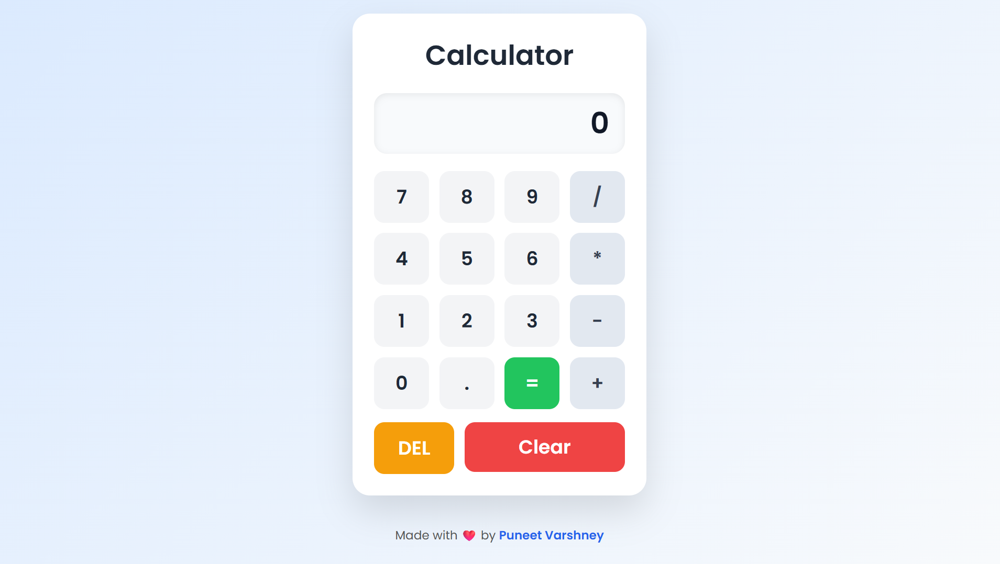

# 🧮 Calculator

A clean and responsive calculator built using HTML, CSS, and JavaScript.

## ✨ Features

- Basic Arithmetic Operations (+, -, ×, ÷)
- Decimal Support
- Delete Last Character (DEL)
- Clear Display
- Error Handling
- Responsive Design
- Clean Modern UI

## 🛠️ Technologies Used

- HTML5
- CSS3
- JavaScript (Vanilla JS)

## 📸 Preview

## 🚀 Live Demo

https://puneetvar1110-max.github.io/Calculator/

## 👨‍💻 Author

Puneet Varshney
